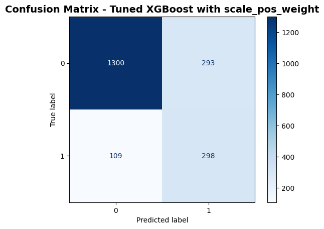
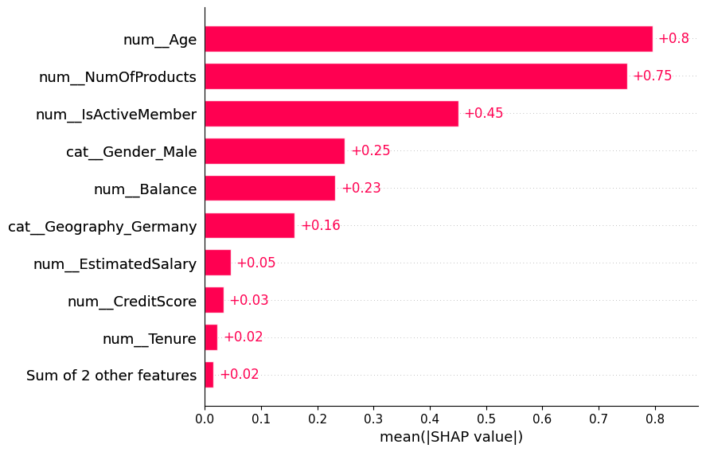
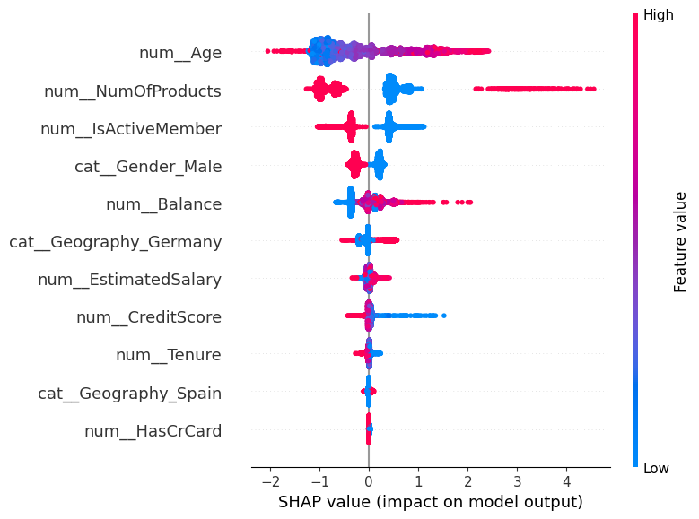

# Customer Churn Analysis for a retail bank
## Executive Summary
This project explores the factors driving customer churn within a bank using descriptive analytics, statistical exploration, and machine-learning modelling.
The analysis aims to identify key patterns that distinguish customers who leave, in order to support data-driven retention strategies.  
Python handled data cleaning, feature exploration, segmentation, predictive modelling (Logistic Regression, KNN, XGBoost), and SHAP-based explainability. Power BI complemented the workflow by visualising key categorical patterns such as geography and gender. Together, these insights highlight the most influential churn factors and enable the bank to target high-risk segments with data-driven retention strategies.
## Business Problem
Customer churn represents a significant challenge for banks, as losing existing customers increases acquisition costs and reduces profitability.  
Understanding which customer segments are most likely to churn will help the bank create retention initiatives effectively.  
This analysis answered key questions:
- Which customer attributes are most correlated with churn?
- How do churn rates differ across variables?
- What actionable insights can help improve customer retention?
## Methodology
1. Cleaned and explored the bank churn dataset in **Python**, applying descriptive and correlation analysis to uncover key churn drivers.  
2. Segmented customers based on account balance, activity status and product ownership to identify high-risk groups.  
3. Built a **Power BI dashboard** to visualise categorical variables (Gender, Geography) and overall churn performance interactively.
4. Built end-to-end machine-learning pipelines (Logistic Regression, KNN, XGBoost) using scikit-learn to predict churn and evaluate model performance.
5. Applied SHAP explainability to interpret feature impact and understand the behaviours driving churn risk.
## Skills
- Python:  Pandas, NumPy, Seaborn, Matplotlib, scikit-learn, data cleaning, feature engineering, correlation analysis, segmentation, and SHAP explainability.
- Power BI: DAX, calculated columns, interactive dashboard design, categorical data visualization, data modeling.
## Results and Business Recommendations
### Key Descriptive Analytics Findings
- **Overall Churn Rate:** **20.37%** - around one in five customers have left the bank.  
- **Age Impact:** Customers aged **40–50** are the most likely to churn; age correlates positively (0.29) with leaving.  

  
   
  <em>Figure 1. Age distribution - churn risk increases for customers aged 40-50.</em>

- **Activity Status:** Inactive members churn at **27%**, nearly double that of active ones (14%).

  
   
  <em>Figure 2. Inactive members show almost twice the churn rate of active customers.</em>

- **Balance Groups:** Churn peaks at **27%** for medium-balance** customers and remains high among high-value ones (23%).  

<em>Figure 3. Medium and high-balance customers contribute largely churn losses.</em>

- **Gender:** Female customers churn more (25% vs 16% of males).  
- **Country**: Germany has the highest churn (**65%**), followed by Spain (34%) and France (33%). 

<em>Figure 4. Power BI dashboard - female and German customers show the highest churn rates.</em>

## Key Machine Learning Findings
The goal of this stage was to build a reliable machine learning model capable of predicting which customers are most likely to churn and understanding the factors driving these predictions.

1. **Model Performance**

- The tuned XGBoost model delivers the best results, achieving a **0.857 ROC-AUC and 73% recall**, meaning it correctly identifies most customers likely to leave compare to other models.
-  It also has the fewest missed churners **(109)**, making it the most reliable model for flagging at-risk customers and supporting targeted retention actions.

  
   
  <em>Figure 5. Confusion Matrix - Tuned XGBoost Model</em>

2. **SHAP Analysis** (explains how each feature influences the model’s churn predictions)

    SHAP identifies three features as the strongest drivers of predicted churn risk:
- **Age**: Higher age corresponds to higher SHAP values, meaning the model predicts greater churn risk for older customers.
- **Active Member**: Being active is associated with lower predicted risk, while inactivity pushes predicted churn risk upward.
- **Number of Products**: Customers with fewer products show higher predicted churn risk, and those with more products generally show lower risk. However, SHAP also reveals a group of high-product customers with elevated predicted risk, suggesting possible issues such as complexity, unmet expectations, or dissatisfaction.

  
   
  <em>Figure 6. SHAP Bar Plot – Top Predictors</em>

  
   
  <em>Figure 7. SHAP Summary Plot – Feature Impact on Churn Predictions</em>

## Business Recommendations
- **Engage mid-aged customers (40–50):** Launch targeted loyalty programs and satisfaction surveys to retain this high-risk segment.  
- **Re-activate inactive members:** Offer personalised reminders, usage rewards, or benefits to increase account activity.  
- **Prioritise medium/high-balance customers:** Provide premium financial services or retention incentives for high-value clients.  
- **Address regional churn in Germany:** Investigate service quality and competition factors to reduce attrition.  
- **Adopt gender focused engagement:** Tailor communication and offers to female customers, who show higher churn tendencies.
- **Address issues among high-product customers:** Investigate whether product bundles are too complex, misaligned with needs, or causing hidden friction among high-product customers.
- **Use the tuned XGBoost model for early churn prediction:** Deploy the model to proactively flag customers likely to leave soon, then prioritise personalised outreach (calls, offers, service checks) to intervene before churn happens.

