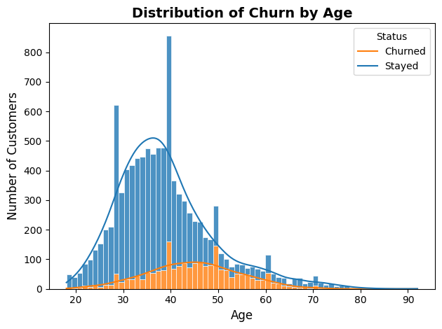
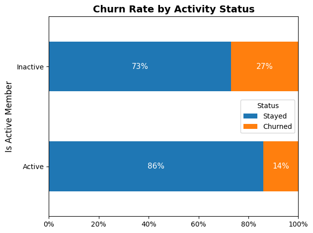
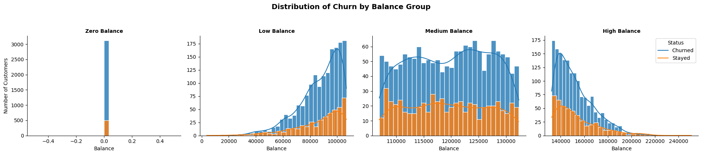
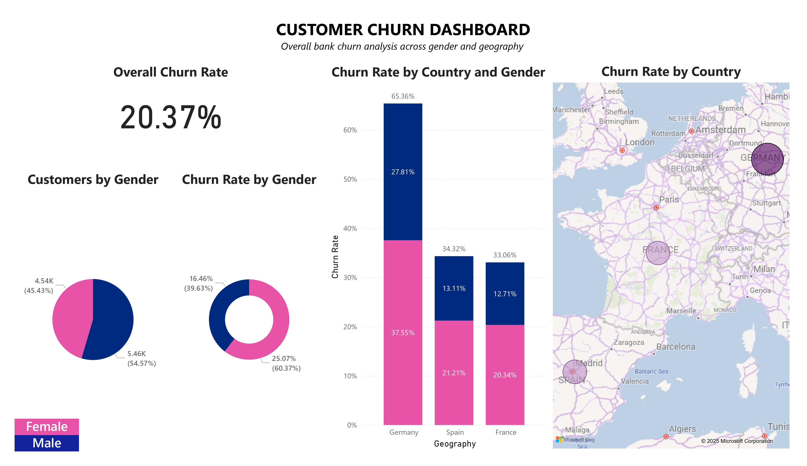

# Customer Churn Analysis for a bank
## Executive Summary

This project explores the factors driving customer churn within a bank using Python-based analytics and Power BI visualization.  
The analysis aims to identify key patterns that distinguish customers who leave, in order to support data-driven retention strategies.  
Python was used for data cleaning, feature exploration, statistical analysis, and segmentation. Power BI complemented the process by visualizing categorical variables, including gender and geography, allowing for a clearer and more interactive understanding of churn behaviour.

## Business Problem
Customer churn represents a significant challenge for banks, as losing existing customers increases acquisition costs and reduces profitability.  
Understanding which customer segments are most likely to churn will help the bank create retention initiatives effectively.  
This analysis answered key questions:
- Which customer attributes are most correlated with churn?
- How do churn rates differ across variables?
- What actionable insights can help improve customer retention?

## Methodology

1. Cleaned and explored the bank churn dataset in **Python**, applying descriptive and correlation analysis to uncover key churn drivers.  
2. Segmented customers based on account balance, activity status and product ownership to identify high-risk groups.  
3. Built a **Power BI dashboard** to visualise categorical variables (Gender, Geography) and overall churn performance interactively.

## Skills
- Python:  Pandas, NumPy, Seaborn, Matplotlib, correlation analysis, segmentation, visualization.
- Power BI: DAX, calculated columns, interactive dashboard design, categorical data visualization, data modeling.

## Results and Business Recommendations

### Key Findings
- **Overall Churn Rate:** **20.37%** - around one in five customers have left the bank.  
- **Age Impact:** Customers aged **40–50** are the most likely to churn; age correlates positively (0.29) with leaving.  

  
   
  <em>Figure 1. Age distribution — churn risk increases for customers aged 40–50.</em>

- **Activity Status:** Inactive members churn at **27%**, nearly double that of active ones (14%).

  
   
  <em>Figure 2. Inactive members show almost twice the churn rate of active customers.</em>

- **Balance Groups:** Churn peaks at **27%** for medium-balance** customers and remains high among high-value ones (23%).  

<em>Figure 3. Medium and high-balance customers contribute largely churn losses.</em>

- **Gender:** Female customers churn more (25% vs 16% of males).  
- **Country**: Germany has the highest churn (**65%**), followed by Spain (34%) and France (33%). 

<em>Figure 4. Power BI dashboard — female and German customers show the highest churn rates.</em>

### Business Recommendations
- **Engage mid-aged customers (40–50):** Launch targeted loyalty programs and satisfaction surveys to retain this high-risk segment.  
- **Re-activate inactive members:** Offer personalised reminders, usage rewards, or benefits to increase account activity.  
- **Prioritise medium/high-balance customers:** Provide premium financial services or retention incentives for high-value clients.  
- **Address regional churn in Germany:** Investigate service quality and competition factors to reduce attrition.  
- **Adopt gender focused engagement:** Tailor communication and offers to female customers, who show higher churn tendencies.
---

